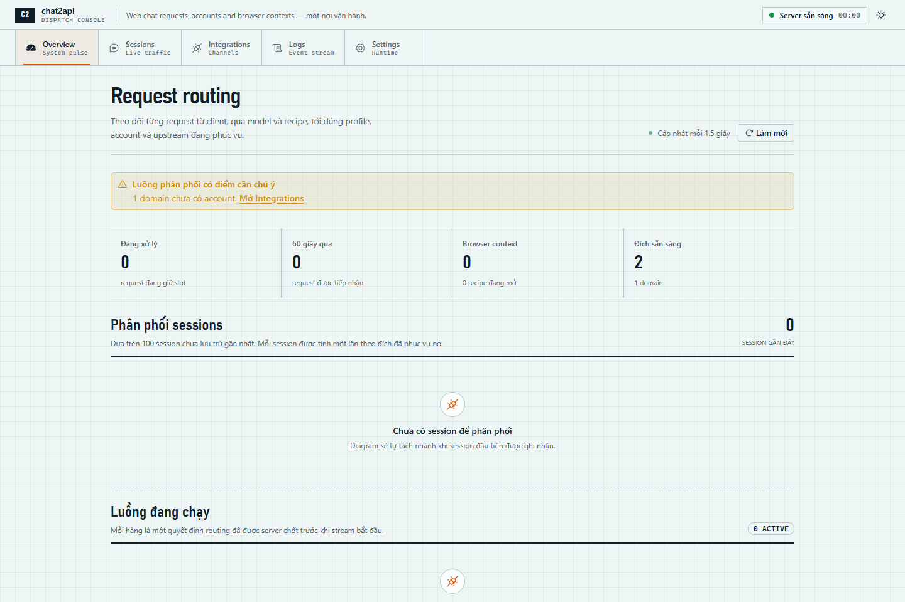
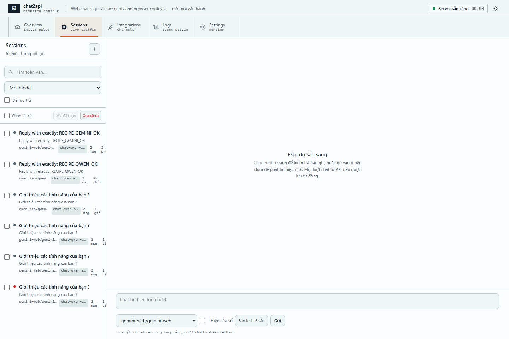
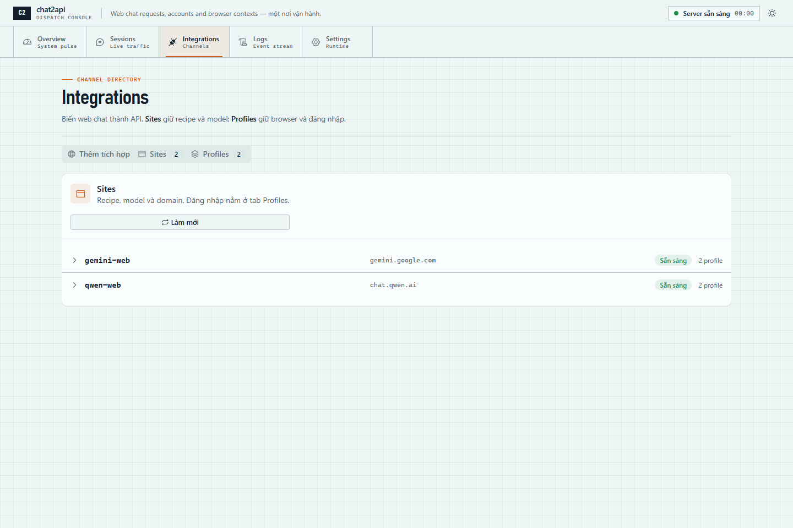
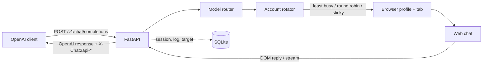
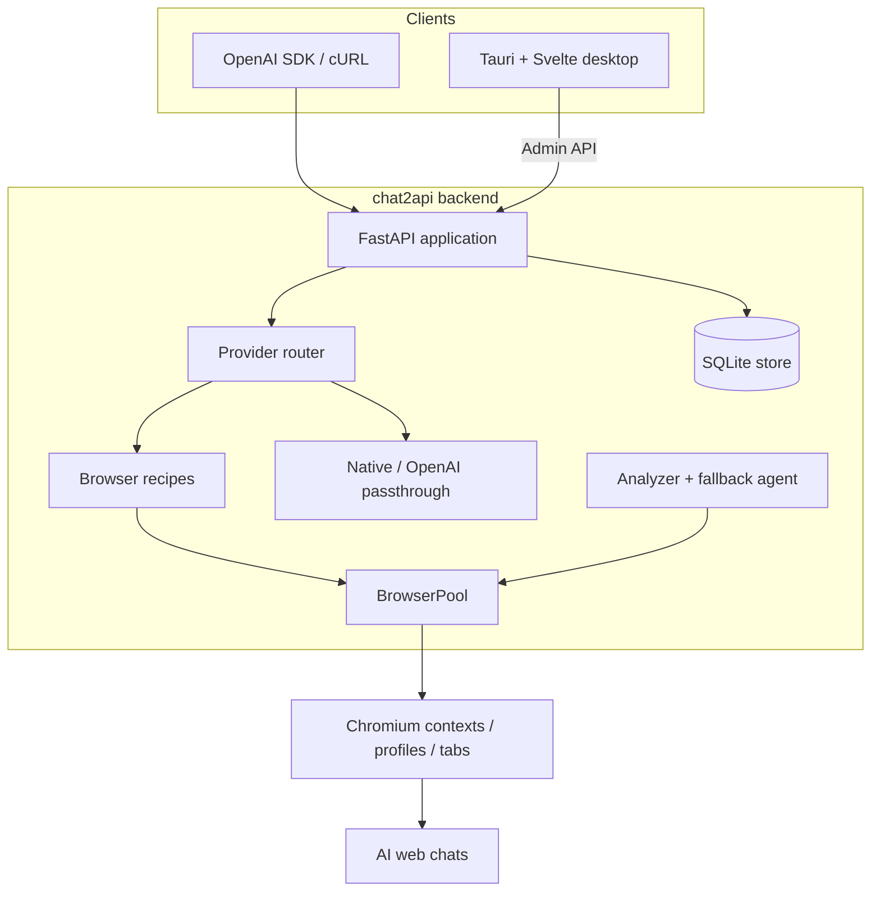

<div align="center">
  

  # chat2api

  **Biến web chat AI thành API tương thích OpenAI — có desktop app, quản lý account/profile và lịch sử hội thoại.**

  [](pyproject.toml)
  [](pyproject.toml)
  [](pyproject.toml)
  [](desktop/package.json)
  [](desktop/package.json)

  [Bắt đầu nhanh](#bắt-đầu-nhanh) · [Desktop app](#desktop-app-windows) · [Gọi API](#gọi-api) · [Tích hợp website](#tích-hợp-web-chat-mới) · [Kiến trúc](#kiến-trúc)
</div>

---

## Tổng quan

`chat2api` tự động thao tác trên các web chat bằng Chromium, thu câu trả lời và trả dữ liệu theo giao thức OpenAI. Ứng dụng phù hợp khi bạn cần dùng một web chat trong Open WebUI, LobeChat, ChatBox, OpenAI SDK hoặc hệ thống nội bộ mà không muốn copy/paste thủ công.

### Điểm nổi bật

- **OpenAI-compatible:** hỗ trợ `GET /v1/models`, `POST /v1/chat/completions` và streaming SSE.
- **Browser automation:** recipe YAML mô tả URL, selector, tín hiệu hoàn tất và timing của từng website.
- **Desktop control center:** dashboard, sessions, integrations, profiles, logs, settings và API key trong một ứng dụng Tauri.
- **Điều phối song song:** phân request qua nhiều account/profile, giới hạn slot và xếp hàng khi quá tải.
- **Đăng nhập dùng chung theo domain:** một phiên đăng nhập có thể phục vụ nhiều recipe cùng domain.
- **Lưu vết đầy đủ:** SQLite lưu session, message, request log, account/profile đích và URL hội thoại gốc.
- **Tích hợp bằng agent:** agent phân tích DOM, tạo recipe và chạy thử website mới.
- **Fallback tùy chọn:** khi recipe liên tục lỗi, agent có thể điều khiển browser trực tiếp.

> [!IMPORTANT]
> Dự án tự động hóa giao diện website. Selector có thể cần cập nhật khi website thay đổi. Hãy tuân thủ điều khoản sử dụng, giới hạn truy cập và chính sách dữ liệu của từng dịch vụ.

## Ảnh chụp màn hình

### Request routing dashboard

Theo dõi request đang chạy, model, recipe, profile/account được chọn, độ trễ và phân bố session.



<details>
<summary><strong>Xem thêm giao diện</strong></summary>

### Sessions workspace

Chat thử, tìm kiếm lịch sử, xem Markdown/HTML/JSON, fork hội thoại và mở lại cuộc trò chuyện trên website gốc.



### Integrations & browser profiles

Thêm website bằng agent, quản lý recipe/account và vận hành Chromium profile.



</details>

## Bắt đầu nhanh

### Yêu cầu

| Thành phần | Phiên bản / mục đích |
|---|---|
| Python | `3.11+` |
| Chromium | Cài qua Playwright |
| Git | Clone và cập nhật mã nguồn |
| Node.js + Rust + MSVC + WebView2 | Chỉ cần khi chạy desktop app trên Windows |

### 1. Cài backend

```bash
git clone <repository-url>
cd chat2api
python -m venv .venv
```

Kích hoạt virtual environment:

```powershell
# Windows PowerShell
.\.venv\Scripts\Activate.ps1
```

```bash
# macOS / Linux
source .venv/bin/activate
```

Cài package và Chromium:

```bash
python -m pip install --upgrade pip
pip install -e ".[dev]"
playwright install chromium
```

### 2. Chạy server

```bash
python -m chat2api serve --host 127.0.0.1 --port 8100
```

Kiểm tra trạng thái:

```bash
curl http://127.0.0.1:8100/health
```

Kết quả mẫu:

```json
{
  "status": "ok",
  "engine": "playwright",
  "contexts": 0,
  "models": 2
}
```

Các địa chỉ hữu ích:

| Địa chỉ | Nội dung |
|---|---|
| `http://127.0.0.1:8100/docs` | Swagger UI |
| `http://127.0.0.1:8100/health` | Health check |
| `http://127.0.0.1:8100/v1/models` | Danh sách model |

> [!NOTE]
> CLI mặc định bind `0.0.0.0`. Ví dụ trên dùng `127.0.0.1` để chỉ mở API trên máy cục bộ.

## Desktop app (Windows)

Desktop app tự khởi động Python backend dạng sidecar, chọn cổng loopback rảnh và hiển thị log ngay trong giao diện.

Chạy script thiết lập từ thư mục gốc:

```powershell
powershell -ExecutionPolicy Bypass -File .\desktop\scripts\setup-and-run.ps1
```

Script kiểm tra và chỉ cài thành phần còn thiếu, sau đó chạy `npm run tauri dev`.

| Tùy chọn | Ý nghĩa |
|---|---|
| `-NoRun` | Chỉ thiết lập môi trường, không mở app |
| `-Port <số>` | Ghim cổng backend; bỏ trống để tự chọn cổng rảnh |

> [!TIP]
> Windows có thể dành riêng một số dải TCP cho Hyper-V/WSL. Nếu một cổng bind thất bại, xem danh sách bằng `netsh interface ipv4 show excludedportrange protocol=tcp` hoặc để app tự chọn cổng.

Chạy thủ công khi máy đã đủ toolchain:

```powershell
cd desktop
npm install
npm run tauri dev
```

### Build EXE và chạy nền

Xem hướng dẫn đầy đủ tại [docs/windows-build-background.md](docs/windows-build-background.md).

## Gọi API

Model ID có dạng `<provider>/<model>`, ví dụ `gemini-web/gemini-web` hoặc `qwen-web/qwen-web` với các recipe mẫu hiện tại. Luôn lấy ID thực tế từ `/v1/models`.

### cURL

```bash
curl http://127.0.0.1:8100/v1/chat/completions \
  -H "Content-Type: application/json" \
  -H "Authorization: Bearer <YOUR_API_KEY>" \
  -d '{
    "model": "<provider>/<model>",
    "messages": [
      {"role": "user", "content": "Viết một lời chào ngắn bằng tiếng Việt"}
    ]
  }'
```

### Python SDK

```python
from openai import OpenAI

client = OpenAI(
    base_url="http://127.0.0.1:8100/v1",
    api_key="<YOUR_API_KEY>",
)

response = client.chat.completions.create(
    model="<provider>/<model>",
    messages=[{"role": "user", "content": "Xin chào"}],
)

print(response.choices[0].message.content)
```

### Node.js SDK

```javascript
import OpenAI from "openai";

const client = new OpenAI({
  baseURL: "http://127.0.0.1:8100/v1",
  apiKey: "<YOUR_API_KEY>",
});

const response = await client.chat.completions.create({
  model: "<provider>/<model>",
  messages: [{ role: "user", content: "Xin chào" }],
  stream: true,
});

for await (const chunk of response) {
  process.stdout.write(chunk.choices[0]?.delta?.content ?? "");
}
```

### Header điều khiển và truy vết

| Header request | Công dụng |
|---|---|
| `X-Chat2api-Session-Id` | Nối nhiều lượt vào cùng một session |
| `X-Chat2api-Account-Id` | Ghim request vào một account cụ thể |
| `X-Chat2api-Headed: true\|false` | Buộc request mở browser hiển thị hoặc chạy ẩn |

Server trả các header sau ngay từ đầu response, kể cả với stream:

| Header response | Nội dung |
|---|---|
| `X-Chat2api-Session-Id` | Session đã ghi request |
| `X-Chat2api-Account-Id` / `X-Chat2api-Account-Label` | Account được chọn |
| `X-Chat2api-Profile-Name` | Chromium profile thực thi |
| `X-Chat2api-Target` | Chuỗi đích `profile/host/account` |
| `X-Chat2api-Headed` | Browser có hiển thị hay không |
| `X-Chat2api-Conversation-Url` | URL hội thoại gốc; có ở response non-stream khi website cung cấp |

## Tích hợp web chat mới

### Cách 1 — dùng desktop app

1. Mở **Integrations**.
2. Nhập URL website.
3. Bật **Hiện browser khi test** nếu muốn quan sát Chromium thao tác.
4. Chọn **Phân tích**.
5. Xem log, kiểm tra recipe, đăng nhập nếu cần rồi publish.

### Cách 2 — dùng CLI

Cấu hình LLM dùng cho agent trong biến môi trường hoặc `.env`:

```dotenv
AGENT_LLM_BASE_URL=https://api.openai.com/v1
AGENT_LLM_API_KEY=<YOUR_AGENT_KEY>
AGENT_LLM_MODEL=<YOUR_MODEL>
```

Chạy phân tích:

```bash
python -m chat2api integrate https://chat.example.com
```

Nếu website yêu cầu đăng nhập:

```bash
python -m chat2api login <recipe-slug>
```

Thêm account khác cho cùng recipe:

```bash
python -m chat2api login <recipe-slug> --account secondary
```

> [!WARNING]
> Các thư mục `auth/`, `secrets/`, `.accounts/`, `data/` và file `.env` có thể chứa cookie hoặc secret và đã được `.gitignore`. Không commit hoặc chia sẻ các tệp này.

## Recipe hoạt động như thế nào?

Recipe nằm tại `recipes/<slug>/recipe.yaml` và mô tả cách điều khiển một website. Hai recipe mẫu hiện có là [`gemini-web`](recipes/gemini-web/recipe.yaml) và [`qwen-web`](recipes/qwen-web/recipe.yaml).

Ví dụ tối giản:

```yaml
slug: example-web
url: https://chat.example.com
models:
  - id: example-model

input:
  selector: "textarea"
  submit: enter

response:
  last_message_selector: ".assistant-message"
  done_signal:
    type: copy_button
    quiet_ms: 600
    fallback_quiet_ms: 15000
    timeout_ms: 120000

timing:
  ready_delay_ms: 1200
  input_delay_ms: 400
  ready_timeout_ms: 20000
```

### Tín hiệu hoàn tất

| `response.done_signal.type` | Khi nào dùng |
|---|---|
| `copy_button` | Khuyến nghị; chốt khi nút Copy của reply cuối xuất hiện |
| `stable_text` | Website không có dấu hiệu hoàn tất rõ ràng |
| `selector_appear` | Có selector riêng xuất hiện khi hoàn tất |
| `selector_disappear` | Nút Stop/loading biến mất khi hoàn tất |

Trong desktop app, mở **Integrations → Sites → Chỉnh sửa** để sửa bằng form hoặc YAML, chạy thử trước khi lưu và reload router mà không cần restart server.

## Account, profile và xử lý song song

Account thuộc về **domain**, không thuộc riêng recipe. State đăng nhập dùng chung nằm dưới `recipes/.accounts/<domain>/`, vì vậy các recipe cùng domain có thể dùng lại một lần đăng nhập.



Các thiết lập chính:

| Khóa | Mặc định | Ý nghĩa |
|---|---:|---|
| `API_ACCOUNT_STRATEGY` | `least_busy` | `least_busy`, `round_robin`, `sticky_session` hoặc `off` |
| `API_MAX_CONCURRENT_PER_ACCOUNT` | `1` | Số request song song trên mỗi account |
| `API_MAX_CONCURRENT_REQUESTS` | `0` | Trần toàn server; `0` là không giới hạn |
| `API_SESSION_MODE` | `per_request` | Tách session theo request hoặc gom theo client window |
| `API_HEADED` | `always` | `always`, `never` hoặc `auto` |
| `BROWSER_PROFILE_MODE` | `storage_state` | Dùng state nhẹ hoặc Chromium profile đầy đủ |
| `POOL_MAX_PROFILES` | `6` | Số tiến trình profile được giữ mở |
| `PROFILE_MAX_TABS` | `8` | Số tab tối đa mỗi profile |

Khi mọi slot đều bận, request mới **chờ trong hàng đợi** thay vì bị từ chối. Request đang chạy không bị đóng để ép pool về giới hạn.

## Kiến trúc



### Thành phần chính

| Đường dẫn | Trách nhiệm |
|---|---|
| `chat2api/main.py` | FastAPI lifecycle, OpenAI API và admin API |
| `chat2api/router.py` | Nạp provider và resolve model ID |
| `chat2api/providers/browser_recipe.py` | Chạy recipe, chọn account/profile, thu reply |
| `chat2api/browserpool.py` | Quản lý Chromium context/profile/tab |
| `chat2api/agents/` | Phân tích website và fallback |
| `chat2api/store/` | SQLite, migration và writer theo batch |
| `desktop/src/routes/` | Các màn hình SvelteKit |
| `desktop/src-tauri/` | Tauri shell và Python sidecar |
| `recipes/` | Recipe YAML và state cục bộ đã ignore |
| `tests/` | Unit và integration tests |

## Cấu hình

Cấu hình có thể đến từ môi trường thật, `.env`, SQLite settings hoặc default. Thứ tự ưu tiên:

```text
Environment / .env  >  SQLite setting  >  default
```

Các khóa thường dùng:

```dotenv
# Security
CHAT2API_KEYS=

# Storage
RECIPES_DIR=./recipes
CHAT2API_DATA_DIR=./data

# Browser
BROWSER_ENGINE=playwright
BROWSER_PROFILE_MODE=storage_state
POOL_MAX_CONTEXTS=4
POOL_MAX_PROFILES=6
PROFILE_MAX_TABS=8

# Recipe timing
RECIPE_TIMEOUT_MS=120000
RECIPE_READY_DELAY_MS=1200
RECIPE_INPUT_DELAY_MS=400
RECIPE_READY_TIMEOUT_MS=20000

# API routing
API_ACCOUNT_STRATEGY=least_busy
API_MAX_CONCURRENT_PER_ACCOUNT=1
API_MAX_CONCURRENT_REQUESTS=0
API_SESSION_MODE=per_request
API_HEADED=always

# Agent integration / fallback
AGENT_LLM_BASE_URL=
AGENT_LLM_API_KEY=
AGENT_LLM_MODEL=
ENABLE_AGENT_FALLBACK=false
ANON_TRIAL_LIMIT=20
```

Phần lớn khóa có thể chỉnh trong **Settings**. Giá trị từ environment hoặc `.env` sẽ khóa giá trị đang chạy và thắng cấu hình lưu trong SQLite.

## API key và bảo mật

- Tạo key trong **Settings → API keys**.
- Scope `chat` bảo vệ `/v1/*`; scope `admin` bảo vệ `/admin/*`.
- Database chỉ lưu SHA-256 của key.
- Key thô chỉ hiển thị **một lần** khi tạo.
- `CHAT2API_KEYS` hỗ trợ bootstrap key dạng CSV cho CI hoặc lần chạy đầu.
- Nếu không có key ở bất kỳ nguồn nào, server chạy ở chế độ mở.

Khuyến nghị khi triển khai:

1. Luôn tạo API key.
2. Bind `127.0.0.1` nếu chỉ dùng cục bộ.
3. Nếu mở ra mạng, đặt sau reverse proxy có TLS và kiểm soát truy cập.
4. Không đồng bộ `data/`, browser profile hoặc account state lên kho công khai.
5. Đặt `API_HEADED=never` trên server không có desktop/display.

## Dữ liệu và session

`CHAT2API_DATA_DIR` mặc định là `./data` và chứa `chat2api.db`. Mỗi request được ghi ở đầu và cuối — không ghi từng SSE delta — để giảm lock contention nhưng vẫn giữ được:

- Prompt và reply, kể cả reply lỗi hoặc bị ngắt giữa stream.
- Model, provider, status, latency và API key đã gọi.
- Account/profile đích và URL hội thoại gốc.
- HTML gốc nếu recipe bật `response.capture_html: true`.

SQLite chạy WAL với một writer thread gom lệnh theo batch. Nếu store không mở được, chat API vẫn tiếp tục chạy nhưng phần lịch sử có thể không được lưu.

## Kiểm thử và phát triển

Chạy toàn bộ test:

```bash
pytest
```

Chạy theo nhóm:

```bash
pytest tests/unit
pytest tests/integration
```

Kiểm tra frontend:

```bash
cd desktop
npm install
npm run check
npm run build
```

Cấu trúc test bao phủ router, config/auth, store, recipe validation, browser pool, account/profile, session, settings và các endpoint chính.

## Xử lý sự cố

<details>
<summary><strong>Browser không mở hoặc Playwright báo thiếu executable</strong></summary>

```bash
playwright install chromium
```

Đảm bảo lệnh được chạy trong đúng virtual environment đã cài `chat2api`.
</details>

<details>
<summary><strong>Server chạy nhưng không có model</strong></summary>

- Kiểm tra `RECIPES_DIR` và cú pháp `recipes/*/recipe.yaml`.
- Mở **Logs** để xem recipe nào không healthy.
- Với desktop sidecar, bảo đảm working directory trỏ về thư mục gốc dự án.
</details>

<details>
<summary><strong>Request bị kẹt hoặc câu trả lời bị cụt</strong></summary>

- Chạy request với `X-Chat2api-Headed: true` để quan sát website.
- Kiểm tra `last_message_selector` và `done_signal`.
- Ưu tiên `copy_button`; tăng `fallback_quiet_ms` cho website có khoảng dừng dài.
- Điều chỉnh `RECIPE_TIMEOUT_MS` và nhóm `timing` của recipe.
</details>

<details>
<summary><strong>Website yêu cầu đăng nhập lại</strong></summary>

Mở **Integrations**, chọn account và đăng nhập lại; hoặc dùng:

```bash
python -m chat2api login <recipe-slug> --account <account-name>
```
</details>

<details>
<summary><strong>Desktop app không bind được cổng trên Windows</strong></summary>

Bỏ tùy chọn `-Port` để app tự chọn cổng rảnh hoặc kiểm tra dải cổng bị loại:

```powershell
netsh interface ipv4 show excludedportrange protocol=tcp
```
</details>

## Tài liệu thiết kế

Thiết kế lưu trữ, session, recipe, account/profile và các pha phát triển chi tiết nằm tại [`docs/design-v2.md`](docs/design-v2.md). Các quyết định và kế hoạch ban đầu nằm trong [`docs/superpowers/specs/`](docs/superpowers/specs/) và [`docs/superpowers/plans/`](docs/superpowers/plans/).

---

<div align="center">
  <strong>chat2api</strong> — một endpoint OpenAI-compatible cho các web chat bạn đang sử dụng.
</div>
