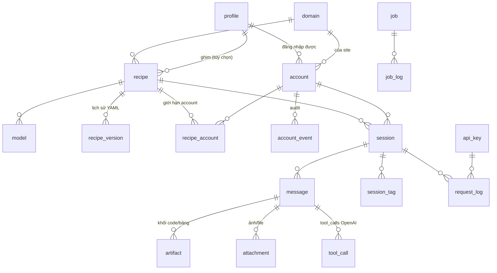

# chat2api v2 — Thiết kế dữ liệu & kiến trúc

Tài liệu này thiết kế lại bốn mảng, theo đúng thứ tự phụ thuộc:

1. **Kho dữ liệu SQLite** cho toàn bộ dự án (§2, DDL đầy đủ ở `chat2api/store/schema.sql`)
2. **Chromium Profile dùng lại được** — một profile đăng nhập nhiều domain, chạy nhiều tab song song (§3)
3. **Trang Sessions** thay Playground — xem markdown / HTML / bản đẹp + tiện ích (§5)
4. **Gộp Recipes + Accounts + Integrate thành một trang** (§6)

Cộng thêm §7: lớp shim tool-calling (Needle2) — tính năng thêm, không bắt buộc.

Trạng thái: **thiết kế**, chưa code. §8 là kế hoạch triển khai theo pha.

---

## 1. Vì sao phải đổi

Trạng thái hiện tại nằm rải rác trên đĩa và trong RAM:

| Thứ | Đang ở đâu | Vấn đề |
|---|---|---|
| Recipe | `recipes/<slug>/recipe.yaml` | Không có lịch sử; agent ghi đè là mất bản chạy được |
| Account | `recipes/.accounts/<domain>/<name>.json` | Một file = một domain. Không chia sẻ được đăng nhập Google giữa các site |
| Health recipe | `Router.failures` (RAM) | Mất khi restart |
| Lượt dùng thử ẩn danh | `_AccountRotator._anon_uses` (RAM) | Restart là reset — giới hạn dùng thử vô nghĩa |
| Log app | `applog._entries` — deque 500 (RAM) | Mất khi restart, không tìm kiếm được |
| Job integrate | `jobs.JOBS` (RAM) | Mất khi restart, không xem lại được |
| Hội thoại | **không lưu** | Playground reload là trắng |
| Settings | `.env` | Chỉ chuỗi phẳng, không audit, `CHAT2API_KEYS` là chuỗi CSV |

Không có gì để dựng trang Sessions lên cả — chưa hề có chỗ chứa hội thoại. Đó là lý do DB đi trước.

### Vị trí file

```
<data_dir>/                    # CHAT2API_DATA_DIR, mặc định ./data
├── chat2api.db                # SQLite (WAL: + .db-wal, .db-shm)
├── profiles/<profile-name>/   # user-data-dir của Chromium
└── blobs/<yyyy>/<mm>/         # ảnh đính kèm, screenshot live-view
```

`recipes/` **giữ nguyên vai trò**: YAML vẫn là thứ người dùng đọc/sửa/commit được. DB là bản mirror có thêm lịch sử, health, và số đếm. Xem §4 để biết bên nào thắng khi lệch.

Thêm vào `.gitignore`: `data/`.

---

## 2. Sơ đồ dữ liệu

DDL đầy đủ (kèm index, view, FTS5 trigger): **`chat2api/store/schema.sql`**.



### 2.1 Bốn nhóm bảng

**Danh tính trình duyệt** — `profile`, `domain`, `account`, `account_event`
`account` là *quan hệ* giữa profile và domain, không phải một file cookie. "Profile `main` đã đăng nhập `chat.qwen.ai` dưới nhãn `codex1`." Một profile có nhiều account (nhiều domain); một domain có nhiều account (nhiều profile) để xoay vòng. Đây là thay đổi cốt lõi cho phép §3.

**Định nghĩa site** — `recipe`, `recipe_version`, `model`, `recipe_account`
`recipe_version` giữ toàn bộ YAML cũ: agent viết lại recipe hỏng thì vẫn rollback được. `model.supports_tools` là cờ tool-calling **gốc** của site — cờ này quyết định §7 có bật shim hay không.

**Hội thoại** — `session`, `message`, `artifact`, `attachment`, `tool_call`, `session_tag`, `message_fts`
Mỗi message assistant lưu **ba** biểu diễn: `content` (innerText thô — thứ trả qua API), `content_markdown` (đã chuẩn hoá), `content_html` (outerHTML chụp từ DOM của site). Đây chính là thứ trang Sessions cần để đổi giữa Pretty / Markdown / HTML mà không phải chạy lại recipe.

**Vận hành** — `request_log`, `job`, `job_log`, `app_log`, `setting`, `api_key`
Đưa bốn thứ đang ở RAM xuống đĩa. `api_key` thay `CHAT2API_KEYS` dạng CSV: mỗi key có nhãn, thu hồi được, và `request_log.api_key_id` truy ngược được ai gọi.

### 2.2 Quy ước

- Thời gian: `INTEGER` = epoch **milliseconds** UTC. Sort được, JS dùng thẳng, không lệch timezone.
- Boolean: `INTEGER` 0/1. JSON: `TEXT`, mặc định `'{}'` chứ không NULL.
- Blob lớn ở đĩa (`data/blobs/`), DB chỉ giữ path — DB nhỏ, backup nhanh, `VACUUM` rẻ.
- `PRAGMA journal_mode=WAL` + `busy_timeout=5000`: FastAPI đọc song song trong khi ghi.

### 2.3 Truy cập từ Python

`chat2api/store/` — `__init__.py`, `schema.sql`, `migrations/`, `dao/`.

- Một `sqlite3.Connection` **per-thread** (`check_same_thread=False` + threading.local).
- Toàn bộ ghi chạy qua `asyncio.to_thread` — SQLite là blocking, không được chạy thẳng trên event loop.
- `store.migrate()` chạy trong lifespan, so `schema_migrations.version`, apply tuần tự các file `migrations/000N_*.sql` trong một transaction mỗi file.
- Ghi log/metric là **best-effort**: `app_log`/`request_log` lỗi không được làm hỏng request chat. Bọc try/except, nuốt lỗi, in stderr.

### 2.4 Dọn dẹp

Task nền mỗi 6 giờ, ngưỡng lấy từ `setting`:

| Bảng | Mặc định |
|---|---|
| `app_log`, `request_log` | 30 ngày |
| `job` + `job_log` | 14 ngày |
| `session` (đã archive, không pin) | 90 ngày |
| `blobs/` mồ côi | quét theo `attachment.path` |

Session được pin không bao giờ tự xoá.

---

## 3. Chromium Profile — một profile, nhiều domain, nhiều tab

### 3.1 Vấn đề của `storage_state`

`browser.new_context(storage_state=...)` chỉ khôi phục **cookie + localStorage**. Hệ quả:

- Một file = một domain → đăng nhập Google cho `gemini.google.com` không dùng lại được cho `chatgpt.com`, dù cùng một tài khoản Google.
- Mất IndexedDB, service worker, cache, extension → nhiều site chat mất luôn phiên (state nằm trong IndexedDB) và bị bot-detect gắt hơn.
- Fingerprint đổi mỗi lần dựng context → site coi như thiết bị mới, hay bắt xác minh lại.

### 3.2 Cách làm mới: persistent context

```python
ctx = await pw.chromium.launch_persistent_context(
    user_data_dir=profile.user_data_dir,   # data/profiles/main/
    headless=profile.headless,
    args=[
        # Chromium bóp CPU tab nền — trang chat đang stream trả lời sẽ đứng.
        "--disable-background-timer-throttling",
        "--disable-backgrounding-occluded-windows",
        "--disable-renderer-backgrounding",
    ],
)
```

Một `user_data_dir` = một danh tính trình duyệt đầy đủ, giữ **mọi** domain đã đăng nhập cùng lúc. Đúng thứ cần: *một profile đăng nhập được nhiều domain khác nhau*.

### 3.3 Pool đổi khoá: từ slug sang profile

Hiện tại `BrowserPool` khoá theo `slug` (hoặc `slug::account`) → mỗi recipe một context → 5 recipe là 5 browser. Mới:

```
profile "main"  ──► 1 tiến trình Chromium (persistent context)
                    ├─ tab: recipe "chat"    (chat.qwen.ai)
                    ├─ tab: recipe "gpt"     (chatgpt.com)
                    └─ tab: recipe "claude"  (claude.ai)
```

`BrowserPool` mới:

- `contexts: dict[profile_name, PersistentContext]` — LRU theo `POOL_MAX_PROFILES`.
- `lease(profile, recipe_slug) -> Page` — một tab dài hạn cho mỗi `(profile, recipe)`, cùng một khoá thì xếp hàng qua `asyncio.Lock` (giữ hành vi hiện tại: hai request cùng recipe không chen vào cùng ô input).
- **Recipe khác nhau trong cùng profile chạy song song** — mỗi tab một lock riêng. Đây là phần "chia tab dùng nhiều web chat một lúc".
- `profile.max_tabs` chặn trên; vượt thì đóng tab LRU (không đóng browser).
- Khớp `--disable-*-backgrounding` ở trên: nếu thiếu, tab nền bị throttle và vòng poll `stable_text` trong `browser_recipe.stream()` sẽ chậm/timeout.

**Khoá tiến trình.** Một `user_data_dir` chỉ được một tiến trình Chromium mở. `profile.lock_pid`/`lock_at` phát hiện server cũ còn treo và báo lỗi rõ ràng, thay vì để Chromium fail với thông báo khó hiểu. Khi start: nếu `lock_pid` còn sống và khác pid hiện tại → từ chối; nếu chết → thu hồi khoá.

**Anonymous.** Recipe chưa có account chạy như cũ: context tạm trên browser headless dùng chung, khoá `__anon__::<slug>`, không đụng profile nào.

**Engine `cloak`.** `cloakbrowser.launch_context_async` không nhận `user_data_dir` — profile có `engine='cloak'` giữ đường storage_state cũ. Cột `profile.engine` là chỗ để rẽ nhánh này.

### 3.4 Di trú account hiện có

Mỗi file `recipes/.accounts/<domain>/<name>.json` → một `profile` tên `<domain>-<name>` (ví dụ `chat-qwen-ai-codex1`) + một `account` với `storage_state_path` trỏ về file gốc.

Lần đầu profile được mở, nếu `storage_state_path` còn set:

1. `context.add_cookies(state["cookies"])`
2. Với mỗi origin trong `state["origins"]`: `page.goto(origin)` rồi `page.evaluate` đổ `localStorage`
3. Xoá `storage_state_path` (đặt NULL) — từ đó profile tự đứng, file JSON cũ giữ lại làm bản sao lưu

Sau di trú, người dùng gộp thủ công: mở profile, đăng nhập thêm domain khác, chat2api tự thêm `account` mới (§6.3). Không cố tự gộp — cookie của hai profile khác nhau không trộn được an toàn.

---

## 4. YAML ↔ DB: bên nào thắng

Quy tắc một câu: **file là nguồn của *định nghĩa*, DB là nguồn của *trạng thái*.**

| Thứ | Nguồn sự thật |
|---|---|
| Selector, timing, models, url | `recipe.yaml` (mirror vào `recipe.yaml`/`recipe.config`) |
| Health, số lần fail, `anon_used` | DB |
| Account / profile / domain | DB (không còn ghi vào `recipe.yaml`) |
| Session, message, log, job | DB |
| Settings | DB, `.env` **override** khi có set |

Lúc khởi động, `store/importer.py` quét `recipes/`, upsert vào `recipe`/`model`/`domain` theo `slug`, và **bump `recipe.version` + chèn `recipe_version`** khi YAML đổi so với bản lưu. Người dùng sửa YAML bằng tay vẫn ăn ngay; đổi từ UI thì ghi cả hai chiều (DB trước, xuất YAML sau, trong `recipe_publish_lock`).

Bộ đếm hỏng của recipe là **mirror** chứ không phải nguồn: `reload()` vẫn xoá nó ở cả RAM lẫn DB, vì người dùng sửa recipe rồi bấm reload là để nó được thử lại từ đầu. Thứ *sống sót* qua reload là lịch sử — `last_ok_at`, `last_error`, `last_error_at`. Đổi ngữ nghĩa gating theo DB sẽ khiến recipe vừa được sửa vẫn bị coi là hỏng, nên không làm.

Khối `login:` trong `recipe.yaml` trở thành **chỉ đọc/di sản** — account chuyển hẳn sang DB. `_resolve_accounts()` đọc DB thay vì quét thư mục.

---

## 5. Trang Sessions (thay Playground)

Route `/sessions` và `/sessions/[id]`. Playground bị bỏ; `chat2api/playground/index.html` đã xoá khỏi repo — **`main.py:99` vẫn đọc file này ở route `/` và sẽ nổ 500**; sửa thành redirect sang docs hoặc trả `{"status":"ok"}` trong pha 1.

### 5.1 Bố cục

```
┌──────────┬────────────────────────────────────┬─────────────┐
│ Danh sách│  Hội thoại                          │  Trình xem  │
│ session  │                                     │  (khi chọn  │
│          │  ┌───────────────────────────────┐  │   1 message)│
│ [tìm]    │  │ user: ...                     │  │             │
│ ○ pin    │  │ assistant: ...   [👁 xem]     │  │ ┌─────────┐ │
│ ● hôm nay│  └───────────────────────────────┘  │ │Pretty   │ │
│ ○ ...    │  ┌───────────────────────────────┐  │ │Markdown │ │
│          │  │ composer                      │  │ │HTML     │ │
│          │  └───────────────────────────────┘  │ │JSON     │ │
└──────────┴────────────────────────────────────┴─────────────┘
```

Cột phải chỉ hiện khi bấm "xem" trên một message; mặc định ẩn để hội thoại rộng.

### 5.2 Bốn tab của trình xem

| Tab | Nguồn | Dùng khi |
|---|---|---|
| **Pretty** | `content_markdown ?? content` → render markdown + highlight code + mermaid | Đọc thường ngày |
| **Markdown** | `content_markdown ?? content`, mono, có nút copy | Dán sang chỗ khác |
| **HTML** | `content_html` — outerHTML gốc của site, render trong `<iframe sandbox>` | Xem đúng như trên site (bảng, KaTeX, widget) |
| **JSON** | Response OpenAI dựng lại từ `message` + `tool_call` | Debug client API |

`content_html` render trong `<iframe sandbox="allow-same-origin">` với CSP chặn mọi request ra ngoài — HTML này đến từ site bên thứ ba, **không** được `{@html}` thẳng vào DOM app.

**Recipe cần thêm một trường** để có `content_html`:

```yaml
response:
  last_message_selector: ".markdown-body"
  capture_html: true       # mới — chụp outerHTML cùng lúc với innerText
```

`_reply_text()` trong `browser_recipe.py` đổi thành `_reply()` trả `(text, html|None)`; `_reply_text()` giữ lại làm wrapper cho code chỉ cần innerText. Mặc định `false` để recipe cũ không đổi hành vi và không phình DB.

HTML không đi kèm từng delta (nó là outerHTML *toàn bộ* element, không phải phần thêm): provider giữ bản chụp cuối ở `last_response_html`, `main.py` đọc sau khi stream đóng.

### 5.3 Tiện ích

Theo session: đổi tên (hoặc tự đặt từ prompt đầu), pin, tag, archive, xoá, **fork** (nhân bản tới message thứ N rồi hỏi tiếp — thử lại một nhánh khác), **replay** (chạy lại toàn bộ prompt trên model khác để so sánh), xuất `.md` / `.html` / `.json` / `.jsonl` (định dạng fine-tune), mở `site_conversation_url` trên site gốc.

Theo message: copy text, copy markdown, copy từng khối `artifact`, tải khối code ra file, ẩn/hiện `reasoning`, xem `request_log` tương ứng (TTFB, tổng thời gian, account nào, có fallback không), chạy lại đúng message này.

Toàn cục: tìm kiếm qua `message_fts` (`MATCH`, có `snippet()`, bỏ dấu tiếng Việt), lọc theo model/recipe/tag/khoảng ngày/có lỗi.

### 5.4 Ghi trong lúc stream

`/v1/chat/completions` nhận thêm header tùy chọn `X-Chat2api-Session-Id`.

1. Trước khi gọi provider: tạo/tìm `session`, chèn message `user`, chèn `request_log` (`status='running'`).
2. Trong lúc stream: **không** ghi DB từng delta. Gom vào buffer trong RAM; ghi `ttfb_ms` một lần khi có delta đầu.
3. Khi xong/lỗi: một transaction — chèn message `assistant`, tách `artifact`, chèn `tool_call`, cập nhật `request_log` và số đếm của `session`.

Client API không gửi header vẫn được lưu, dưới `session.kind='api'`, gom trong cửa sổ 30 phút — để mọi thứ đi qua server đều xem lại được. `api_key_id` chỉ có từ pha 6, nên hiện gom theo `(model, sha256(authorization + user-agent)[:20])`; hash lưu trong `session.params.client` và không khôi phục lại được token thô.

**Nối history.** Desktop gửi lại toàn bộ hội thoại mỗi lượt. Chỉ phần *đuôi* được chèn thêm khi history gửi lên là prefix khớp đúng với những gì đã lưu; nếu client sửa một nhánh cũ thì chỉ lấy message cuối, thay vì nhân đôi cả session.

---

## 6. Trang Integrations gộp (Recipes + Accounts + Integrate)

Nav từ 7 tab xuống 5: **Tổng quan · Sessions · Integrations · Logs · Settings**.

Route `/integrations`, ba panel xếp dọc, tất cả trên một trang:

```
┌─ THÊM SITE ────────────────────────────────────────────────┐
│ [https://...            ] [□ hiện browser] [ PHÂN TÍCH ]   │
│ ─ job log (CRT) khi đang chạy ─                            │
└────────────────────────────────────────────────────────────┘
┌─ SITE ĐÃ TÍCH HỢP ─────────────────────────────────────────┐
│ ▸ chat      chat.qwen.ai   1 model  ●ok   2 account        │
│ ▾ gpt       chatgpt.com    1 model  ●lỗi  0 account  ⚠dùng thử 3/20 │
│     models: gpt-web              [reload] [đóng browser] [xóa] │
│     accounts (theo domain chatgpt.com):                    │
│       · main / work      active    [mở lại] [xóa]          │
│       + thêm account…                                      │
└────────────────────────────────────────────────────────────┘
┌─ PROFILE TRÌNH DUYỆT ──────────────────────────────────────┐
│ main     3 domain  4 tab tối đa  ○ đang chạy  [mở] [sửa]   │
│ work     1 domain  2 tab tối đa  ● rảnh       [mở] [sửa]   │
│ + profile mới                                              │
└────────────────────────────────────────────────────────────┘
```

Recipe là hàng mở rộng được; account nằm **bên trong** hàng recipe (nhóm theo domain của recipe) — đó là chỗ người dùng thực sự đi tìm chúng. Panel Profile ở dưới cùng vì là hạ tầng, không phải việc hằng ngày.

### 6.1 Luồng thêm account

Một dialog duy nhất, dùng chung cho "thêm từ recipe" và "thêm độc lập":

```
Thêm account
  Domain    [ chatgpt.com                     ▾ ]   ← chọn/nhập/tự dò
  Profile   [ main (3 domain)                 ▾ ]   ← chọn hoặc "+ profile mới"
  Nhãn      [ work                              ]
                                    [ MỞ BROWSER ]
```

**Tự dò domain**, theo thứ tự:

1. Mở từ một recipe → điền sẵn domain của recipe đó, khoá lại.
2. Người dùng dán URL → `accounts.domain_of()` rút host, bỏ `www.`.
3. Người dùng gõ tay → dropdown gợi ý mọi `domain.host` đã biết, cho nhập tự do.
4. **Để trống** → mở browser với trang blank; người dùng tự vào site, đăng nhập; khi bấm "lưu", server đọc `context.cookies()`, lọc cookie phiên (`session`/`auth`/`token`/`sid`), suy ra domain và **tạo `domain` mới nếu chưa có**. Đây chính là "nếu không có thì để trống tạo mới".

Sau khi lưu, server còn dò thêm: mọi domain khác trong profile mà có cookie đăng nhập nhưng chưa có `account` → hiện gợi ý *"Profile này còn đăng nhập gemini.google.com — thêm luôn?"*. Đây là phần biến "một profile nhiều domain" thành thứ nhìn thấy được trên UI.

### 6.2 API mới

```
GET    /admin/profiles                     danh sách + số domain + đang chạy
POST   /admin/profiles                     {name, engine, headless, max_tabs, proxy, ...}
PATCH  /admin/profiles/{id}
DELETE /admin/profiles/{id}                từ chối khi còn account đang được recipe dùng
POST   /admin/profiles/{id}/open           mở cửa sổ để thao tác tay
POST   /admin/profiles/{id}/detect         quét cookie → domain đã đăng nhập chưa khai báo

GET    /admin/domains
POST   /admin/accounts                     {domain?, profile_id?, label} → mở browser
POST   /admin/accounts/{session_id}/save   dò domain khi trống, tạo account
DELETE /admin/accounts/{id}
POST   /admin/accounts/{id}/reopen         mở lại đúng profile để re-login

GET    /admin/sessions?q=&recipe=&tag=&limit=
GET    /admin/sessions/{id}                kèm message + artifact + tool_call
PATCH  /admin/sessions/{id}                title, pinned, archived, tags
DELETE /admin/sessions/{id}
POST   /admin/sessions/{id}/fork           {up_to_seq}
GET    /admin/sessions/{id}/export?format=md|html|json|jsonl
```

Bộ endpoint `/admin/recipes/{slug}/accounts*` hiện tại giữ nguyên đường dẫn nhưng chuyển sang DAO mới, để desktop chuyển dần từng phần.

---

## 7. Shim tool-calling (tuỳ chọn)

Vấn đề: `/v1/chat/completions` chưa nhận `tools`. ChatGPT web / Claude web qua Playwright không có function-calling kiểu OpenAI API, nên client dùng tools không chạy được với các model đó.

Đây là **tính năng thêm**, không phải sửa lỗi đang có. Chỉ đáng làm nếu bạn thực sự cần function-calling qua các site web-chat không hỗ trợ sẵn. Nếu client của bạn chỉ chat thuần → bỏ qua §7, phần còn lại của thiết kế không phụ thuộc vào nó.

### 7.1 Luồng

Bật khi request có `tools` **và** `model.supports_tools = 0`:

1. **Vào** — `prompt.py` chèn phần mở đầu mô tả tool (tên, JSON Schema tham số) và yêu cầu trả trong khối ```` ```tool_call ```` khi cần gọi.
2. **Ra** — chuỗi extractor, dừng ở cái đầu tiên thành công:

   | Bậc | Cách | Ghi vào `tool_call.parser` |
   |---|---|---|
   | 1 | Khối fence `tool_call` + `json.loads` | `fenced` |
   | 2 | Quét JSON lỏng: object đầu tiên cân bằng ngoặc có khoá `name` khớp tool | `loose` |
   | 3 | **Needle2 (45M) chạy local** — dịch prose → JSON khi site phớt lờ định dạng | `needle2` |

3. Có tool_call → `finish_reason: "tool_calls"`, `content` là phần text còn lại sau khi cắt vùng đã chuyển đổi. Không có → trả text thường, y như bây giờ.

### 7.2 Streaming

Không stream được một tool_call dở dang. Giải pháp: stream bình thường cho tới khi thấy mở fence (hoặc `{` đầu dòng ở chế độ lỏng), từ đó **giữ lại** buffer tới hết. Nếu hoá ra không phải tool_call, xả buffer ra một cục. Trễ chỉ xảy ra ở message thực sự gọi tool.

### 7.3 Đóng gói

`chat2api/tools/` — `schema.py` (pydantic cho `tools`/`tool_choice`), `extract.py` (bậc 1–2, thuần regex), `needle2.py` (bậc 3, import lười). Cài thêm: `pip install "chat2api[tools]"`. Thiếu gói → tự rơi về bậc 1–2, log một dòng warn, không nổ.

Cấu hình: `TOOLS_SHIM = off | regex | needle2` (mặc định `regex`), `TOOLS_SHIM_MODEL_PATH`.

Cột `tool_call.parser` + `confidence` cho phép trang Sessions hiện *"gọi tool này do Needle2 suy ra, độ tin 0.62"* — audit được chất lượng shim thay vì tin mù.

---

## 8. Kế hoạch triển khai

Mỗi pha đứng độc lập, chạy được, và có test riêng.

| Pha | Nội dung | File chính | Rủi ro |
|---|---|---|---|
| **1** | `store/` + migration runner + schema v1. `applog` và `jobs` ghi xuống DB (vẫn đọc từ RAM). Sửa route `/` đang trỏ vào playground đã xoá. | `store/*`, `applog.py`, `jobs.py`, `main.py` | Thấp — chỉ thêm |
| **2** | Import: quét `recipes/` → `recipe`/`model`/`domain`; `.accounts/*.json` → `profile`/`account`. Router đọc health từ DB. | `store/importer.py`, `router.py` | Thấp — import idempotent |
| **3** | Ghi session/message + `capture_html`. Trang `/sessions`, xoá `/playground`. | `main.py`, `browser_recipe.py`, `routes/sessions/` | Trung bình — chạm đường chat |
| **4** | `launch_persistent_context`, pool khoá theo profile, tab song song, seed từ storage_state. | `browserpool.py`, `browser_recipe.py`, `login_sessions.py` | **Cao** — thay lõi trình duyệt |
| **5** | Gộp `/integrations`, dialog account có tự dò domain, panel profile. | `routes/integrations/`, `main.py` | Trung bình |
| **6** | Settings + api_key vào DB. | `settings.py`, `auth.py` | Thấp |
| **7** | Shim tool-calling (tuỳ chọn). | `tools/*` | Trung bình, tách biệt |

Pha 4 là chỗ nguy hiểm nhất: nó thay cách mọi recipe lấy trình duyệt. Cách giảm rủi ro — cờ `BROWSER_PROFILE_MODE = storage_state | profile` mặc định `storage_state`, đường mới chạy song song cho tới khi bạn tự tin lật cờ.

### Test cần thêm

- `tests/unit/test_store_migrate.py` — migration idempotent; DB rỗng và DB đã có version.
- `tests/unit/test_importer.py` — recipe/account từ đĩa vào DB; chạy hai lần không nhân đôi.
- `tests/integration/test_sessions_endpoints.py` — CRUD, fork, export, FTS có dấu tiếng Việt.
- `tests/integration/test_pool_profile.py` — hai recipe cùng profile chạy song song; recipe thứ ba vượt `max_tabs` bị xếp hàng; profile bị khoá pid thì báo lỗi rõ.
- `tests/unit/test_tool_extract.py` — ba bậc extractor, có cả trường hợp không phải tool_call.

---

## 9. Quyết định đã chốt

1. **`data_dir` = `./data`** cạnh repo, đổi được bằng `CHAT2API_DATA_DIR`.
2. **`storage_state` là mặc định lâu dài.** Persistent profile là **opt-in**, không phải đích đến — cờ `BROWSER_PROFILE_MODE = storage_state | profile` giữ mặc định `storage_state` vô thời hạn. Hệ quả cho pha 4: đường profile phải sống *song song* với đường cũ, không thay thế nó; mọi test hiện có phải xanh ở cả hai chế độ.
3. **§7 (shim tool-calling) chưa làm.** Bảng `tool_call` vẫn nằm trong schema v1 để không phải migrate về sau, nhưng không có code nào ghi vào nó cho tới khi §7 được bật.

### Tiến độ

| Pha | Trạng thái |
|---|---|
| 1 — `store/` + migration runner + applog/jobs xuống DB | ✅ xong |
| 2 — import `recipes/` và `.accounts/` vào DB | ✅ xong |
| 3 — session/message + `capture_html` + trang `/sessions` | ✅ xong |
| 4 — persistent profile (opt-in) | chưa |
| 5 — gộp `/integrations` | chưa |
| 6 — settings + api_key vào DB | chưa |
| 7 — shim tool-calling | **không làm** |
